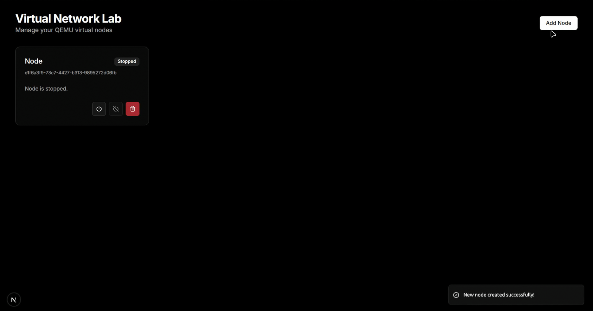

# Minimal Network Lab

> A web-based sandbox environment for creating, managing, and interacting with lightweight virtual machines using QEMU and Guacamole. Built with Next.js and Docker.



## About The Project

This project provides a "Minimal Network Lab" where users can instantly spin up virtual nodes from a selection of base images. Each node runs in its own isolated QEMU process and is accessible directly in the browser through an integrated Apache Guacamole client.

It's designed for quick network experiments, testing configurations, or learning about VMs without the overhead of heavy virtualization software.

---

## Built With

* **Frontend:** Next.js, TypeScript, Tailwind CSS, shadcn/ui
* **Backend:** Next.js API Routes, Node.js (`child_process`)
* **Virtualization:** QEMU
* **Remote Access:** Apache Guacamole
* **Containerization:** Docker & Docker Compose

---

## Getting Started

To get a local copy up and running, follow these steps.

### Prerequisites

You must have the following software installed on your machine:
* Node.js (v20 or later)
* npm
* Docker and Docker Compose
* QEMU

### Setup

1.  **Clone the repository:**
    ```sh
    git clone [https://github.com/your_username/network-lab.git](https://github.com/your_username/network-lab.git)
    cd network-lab
    ```
2.  **Download Base Images:**
    This project requires QEMU base images to create nodes. Create a `base_images` folder in the root of the project and place your `.qcow2` files there.

    You can download example images here:
    * **TinyCore Linux:** [Download Link](https://sourceforge.net/projects/gns-3/files/Qemu%20Appliances/linux-tinycore-11.1.qcow2/download) (Note: you will need to convert to `.qcow2` if you downloaded `ISO` instead)
    * **Cirros Cloud Image:** [Download Link](https://download.cirros-cloud.net/0.5.2/cirros-0.5.2-x86_64-disk.img) (Rename to `.qcow2`)

    Your directory structure should look like this:
    ```
    network-lab/
    ├── base_images/
    │   ├── linux-tinycore-11.1.qcow2
    │   └── cirros-0.5.2.qcow2
    ├── src/
    └── package.json
    ```
3.  **Install NPM packages:**
    ```sh
    npm install
    ```
4.  **Set up environment variables:**
    Create a file named `.env.local` in the root of the project and add the following variable. This password will be used for the Guacamole admin user.
    ```env
    # network-lab/.env.local

    # This password will be set for the 'guacadmin' user inside Guacamole
    GUACAMOLE_ADMIN_PASSWORD=your_strong_password_here
    ```
5.  **Run the development server:**
    This command will start the Next.js application.
    ```sh
    npm run dev
    ```
    The application will be available at `http://localhost:3000`.

---

## Usage with Docker

The entire application stack (Next.js, Guacamole, Postgres DB) can be run easily with Docker Compose.

1.  **Build and run the containers:**
    ```sh
    docker compose up --build
    ```
2.  **Access the applications:**
    * **Network Lab UI:** `http://localhost:3000`
    * **Guacamole UI:** `http://localhost:8080/guacamole`
        * **Username:** `guacadmin`
        * **Password:** The password you set in your `.env.local` file, by default `guacadmin`