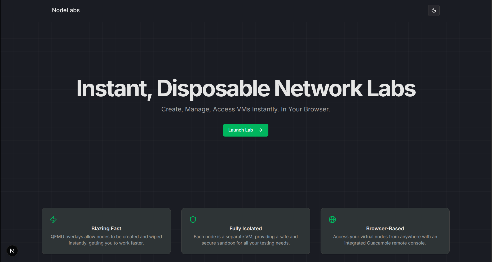

# NodeLabs: A Web-Based Virtual Machine Sandbox

NodeLabs is a full-stack application designed to create, manage, and interact with QEMU-based virtual machines through a simple and modern web interface. It leverages QEMU's efficient qcow2 overlay system for instant node creation and integrates with Apache Guacamole to provide seamless, in-browser console access to the virtual nodes.

## 📹 Project Demo

[](https://youtu.be/bnMm-nO8pSg)

*Click the thumbnail above to watch the full project demonstration video.*

## 🌐 Live Demo

**Deployed Simulation (Frontend Only):**  
 [https://network-lab-eta.vercel.app/](https://network-lab-eta.vercel.app/)

> ⚠️ **Note:**  
> This deployment is an early **frontend simulation** of the project.  
> The current version demonstrates the user interface and workflow only — virtual machine creation and backend integrations (e.g., QEMU, Guacamole) are **not yet functional**, but can be used when installed locally (follow instructions below).  
> A full version with live VM management will be released later on the main branch.


## 🚀 Current Status

> 🏗 **Development done, full deployment yet to complete**
>
> The `master` branch contains the **main backend-integrated version** of the project.
>  
> It supports:
> - Creating and managing real VM instances  
> - QEMU-based virtualization  
> - Guacamole-powered browser console access  
> - Persistent node management and API control  

A functional **frontend-only simulation** is already live for previewing the UI flow.

---

## ✨ Features

- **Complete VM Lifecycle Management**: Create, run, stop, wipe, and delete virtual nodes via a clean user interface.
- **Efficient Disk Storage**: Utilizes QEMU's qcow2 copy-on-write overlays, where each VM only stores its changes from a central base image, saving significant disk space.
- **Integrated Web Console**: Access the graphical console of any running VM directly from the browser, powered by an integrated Apache Guacamole stack.
- **Concurrent Operations**: Designed to run and manage multiple isolated virtual machines simultaneously, with automatic VNC port allocation.
- **Containerized Architecture**: The entire application stack (Next.js App, Guacamole, Database) is managed with Docker Compose for simplified setup and consistent deployment.


## 🛠️ Tech Stack

| Component | Technology |
|-----------|-----------|
| Framework | Next.js (React, API Routes) |
| Language | TypeScript |
| Styling | Tailwind CSS, shadcn/ui |
| Virtualization | QEMU |
| Remote Access | Apache Guacamole, VNC |
| Database | PostgreSQL |
| Containerization | Docker, Docker Compose |

## 🚀 Getting Started

Follow these instructions to set up and run the project locally.

### 1. Clone the Repository

```bash
git clone [https://github.com/Sheikh162/network-lab.git](https://github.com/Sheikh162/network-lab.git)
cd network-lab 
```

### 2\. Configure Environment Variables

Create a `.env.local` file in the project root by copying the example:
Bash

```bash
cp .env.example .env.local
```

### 3\. Run the Application

Since the Next.js application is not managed by Docker Compose, you'll need to run it directly on your local machine.

First, install the necessary dependencies using your preferred package manager.

Install Dependencies:

Bash
```bash
npm install
```
This command reads the package.json file and installs all the required Node.js packages into the node_modules directory.
Start the Development Server: Once the dependencies are installed, start the Next.js development server.

Bash
```bash
npm run dev
```
The frontend application will now be running and accessible in your web browser, typically at http://localhost:3000
* * * * *

📖 How to Use (Simulation)
-------------
1.  **Access the Frontend**: Open your web browser and navigate to http://localhost:3000/lab.
2.  **Create a Node**: Select a base image from the dropdown menu and click "Create New Node". This will simulate adding a node card.
3.  **Run/Stop/Wipe/Delete Nodes**: Use the buttons on the node card to simulate these actions. The node's status badge will update accordingly.
4.  **Open the Console**: Clicking "Open Console" on a "running" node will show an alert indicating this feature is disabled in the simulation.

* * * * *

📁 Project Structure
--------------------

```bash
network-lab/
├── assets/               # Demo videos and other assets
├── public/               # Static assets for Next.js
├── src/
│   ├── app/              # Next.js App Router pages and API routes (mocked)
│   ├── components/       # React components
│   └── lib/              # Mocked backend logic (mockNodeManager.ts)
├── .env.example          # Example environment variables (not used in sim)
├── .gitignore
└── README.md             
```

* * * * *

🐛 Troubleshooting (Simulation)
------------------

### Nodes not loading
- Check the browser's developer console (F12) for any JavaScript errors. 
- Ensure the mock API routes are correctly set up.

### Actions not working
- Verify the API calls in NodeCard.tsx are correctly pointing to your mock API endpoints, mock functions in mockNodeManager.ts are updating the state as expected.

